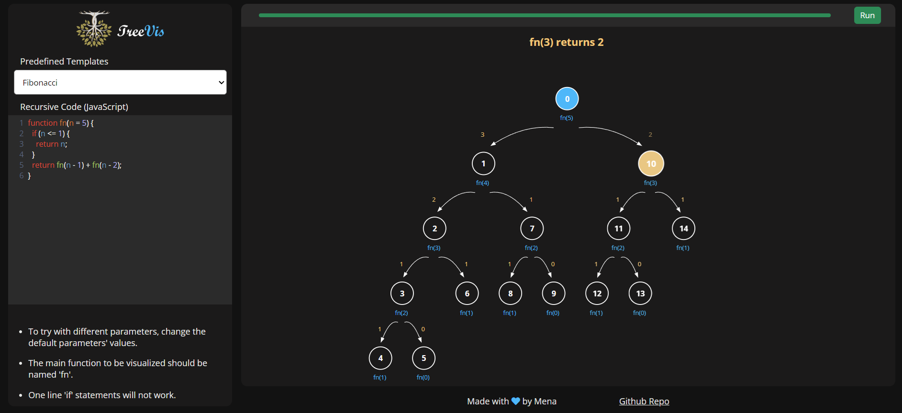

# Visualizing Recursive Functions

This project aims to visualize the execution of recursive functions by tracing the calls, their parameters, return values, and sub-calls. The visualization helps in understanding the flow of recursion and how functions interact.

## Try It Yourself!

You can try the visualization live on the website: [TreeVis Demo](https://mena-saleh.github.io/TreeVis/)

## Features

- **Recursive Function Visualization**: Trace and visualize the steps of recursive function calls.
- **Graph Data Structure**: Store detailed information of each recursive call (parameters, return values, and child calls) in a graph structure.
- **DFS Traversal**: Use Depth-First Search (DFS) to explore the recursive tree and highlight the order of function calls.

## Libraries Used

- **CodeMirror**: Provides an interactive code editor for displaying the recursive function code.
- **SweetAlert2**: Used for displaying pop-up alerts to inform the user of specific actions or errors.
- **PanZoom**: Adds pan and zoom capabilities to the visualization, making it easier to explore the recursive tree.

## Technology

- **Vanilla JavaScript**: The project is built with pure JavaScript, with no frameworks or external JS libraries other than the ones mentioned for mostly visual functionalities.

## Approach

1. **Graph Structure**:

   - Each recursive call is represented as a node in the graph.
   - The graph stores the function parameters, return values, and the child calls (sub-nodes).
   - The graph is updated dynamically as the recursive function progresses.

2. **DFS Traversal**:

   - Start from the root node (initial recursive call).
   - Use DFS to traverse the entire recursive tree, visiting each child recursively.
   - Highlight each node in the order of traversal to visualize the flow of recursion.

3. **Visualization**:
   - The recursive tree is drawn using DOM elements, displaying nodes and edges that represent the function calls and their relationships.
   - The recursive function's parameters, return values, and sub-calls are displayed as the traversal progresses.

## Author

Mena Ashraf Mikhael Saleh  
Email: [Mena.a.saleh.2001@gmail.com](mailto:Mena.a.saleh.2001@gmail.com)
